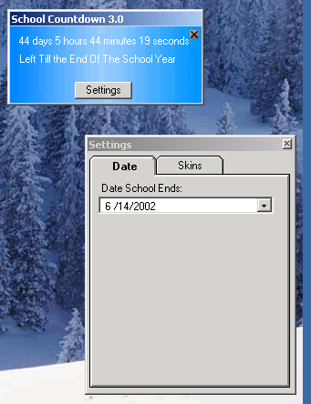

<div align="center">

## \_\*\* School Countdown 3\.0 \*\*\*


</div>

### Description

This program counts down till the end of the school year. Select your own date using DTPicker. Also uses SSTab nad writes to INI the poisition of the form and the date. Minimizes after 10 seconds into taskbar, with a popup menu and an Icon. Before clicking the back button, Please VOTE FOR ME!!!(My code teaches a lot of stuff)
 
### More Info
 


<span>             |<span>
---                |---
**Submitted On**   |2002-04-30 18:18:00
**By**             |[Tomas Tupy](https://github.com/Planet-Source-Code/PSCIndex/blob/master/ByAuthor/tomas-tupy.md)
**Level**          |Intermediate
**User Rating**    |4.2 (50 globes from 12 users)
**Compatibility**  |VB 5\.0, VB 6\.0
**Category**       |[Math/ Dates](https://github.com/Planet-Source-Code/PSCIndex/blob/master/ByCategory/math-dates__1-37.md)
**World**          |[Visual Basic](https://github.com/Planet-Source-Code/PSCIndex/blob/master/ByWorld/visual-basic.md)
**Archive File**   |[School\_Cou777794302002\.zip](https://github.com/Planet-Source-Code/tomas-tupy-school-countdown-3-0__1-34268/archive/master.zip)

### API Declarations

```
'Included in code
```


